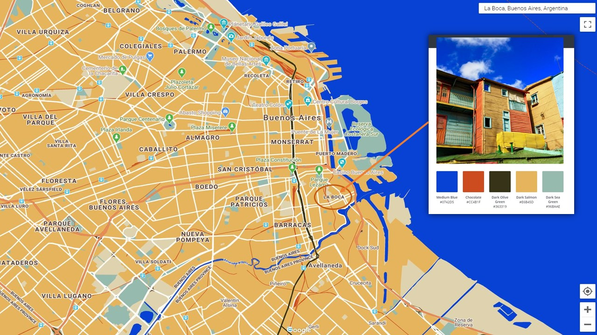
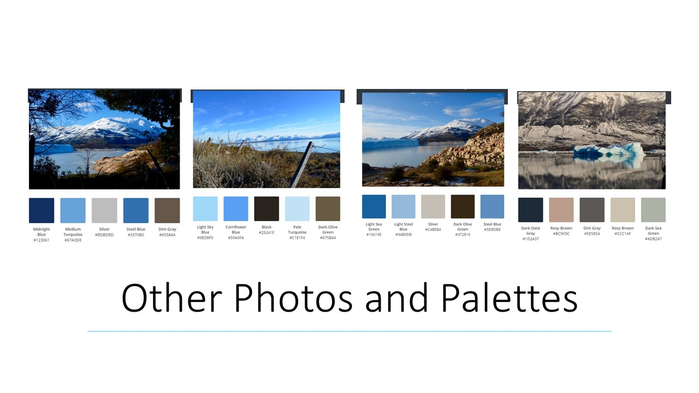
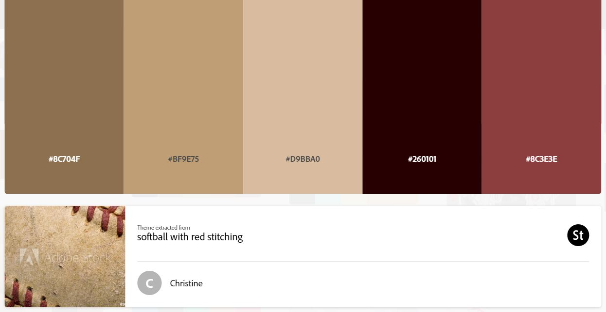
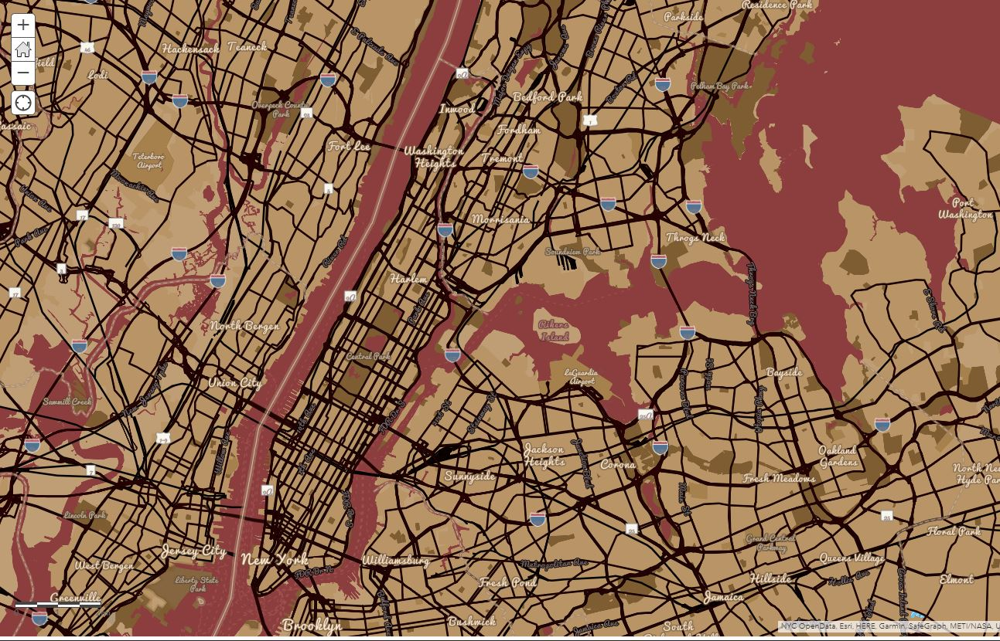
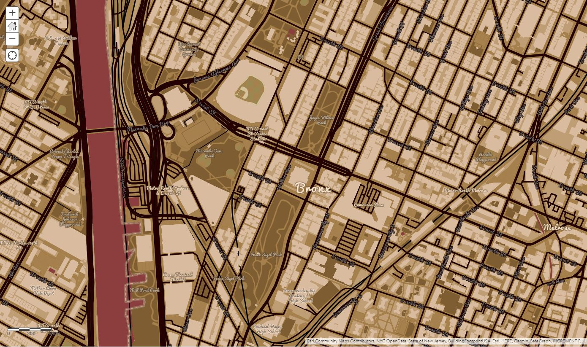
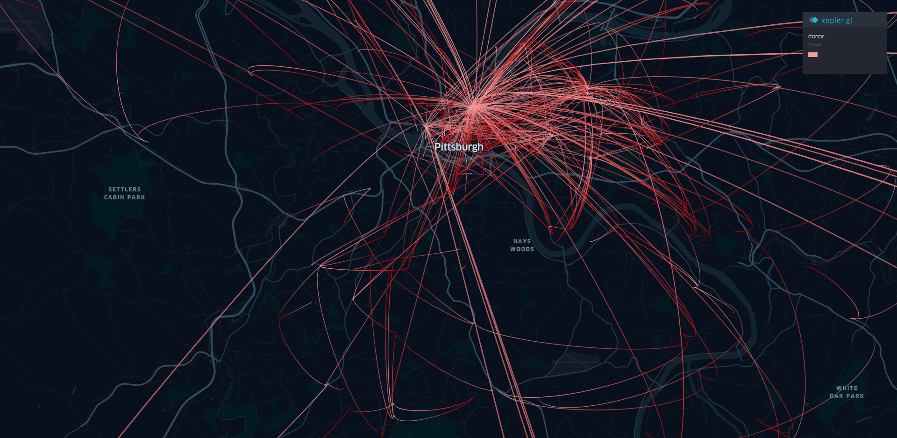
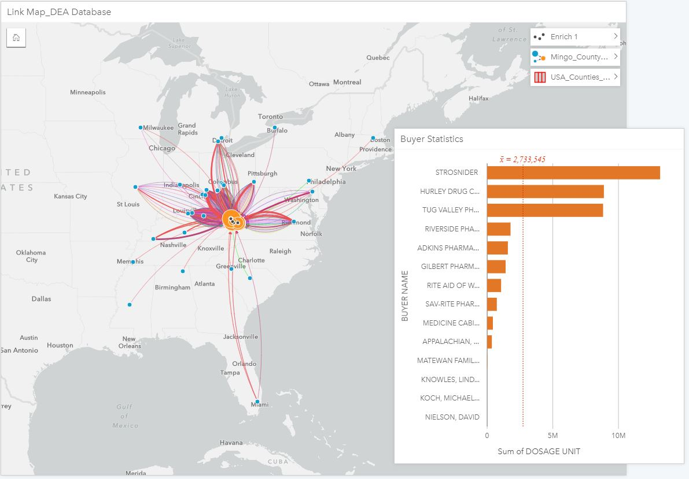

# gis-portfolio
This is my portfolio for the Advanced GIS course at Heinz College.

# About Me
I'm a second year and final semester student in Public Policy & Management at Carnegie Mellon University's Heinz College. Before Heinz, I was working as a Fiscal Policy Analyst in the Massachusetts Senate Ways & Means committee as a post-Northeastern University undergrad transplate from Scranton, PA. While working for the Committee, I had the opportunity to combine my personal mission and academic experiences in working toward equitable and effective housing and homelessness policy, and managed to help shepherd in a few reforms for families and children at risk of housing instability and homelessness. I've folded my passion for place-based socio-economic opportunity into a skillset well positioned to effect transit oriented development policy and planning. 

Since enrolling at Heinz, I've worked for an organization helping to emeliorate the vacant land and storm water crises in Greater Pittsburgh, helped build a speaker series bringing public servants in to share their experience, and bought a grill that is my most prized possession. Outside of grad school and work, my four-year-old, K'nex-loving nephew has called me "the most fun to build monsters with" and "most good bowler" compared to my siblings. I believe that speaks best to my qualifications, in GIS and otherwise.

# What I Hope to Learn
As a former 7th grade Geography Bee Champion of Lackawanna County and a guy whose Dad built picture frames for old maps he found in bookstores, I've always enjoyed maps. For better or worse, I couldn't get the GIS skills I wanted to in undergrad, and since have relied on my grad school studies to provide the opportunity to meet my childhood and professional dreams. In that process, I studied the geospatial barriers to access of paratransit for Pittburgh's persons with disabilities and elderly residential populations. [See the link here](https://storymaps.arcgis.com/stories/f7611f559d994e72863f2a3e42fa35a8). I am taking this class to learn how to better present this information, and build dashboards that could be useful for communities that lack the access and financing for more in-depth study and operations management.

We will be learning tools outisde of the ARCGis platform, which, with the proper experience and know-how, can be game changing open source software that can move policy innovation forward at the local level. By extension, my hope is that smarter, more evidenced and practical based policy will change the political equation we find ourselves in at this moment. That is a bigger question and answer than this course can provide, but I hope the skills I learn in the process will give me the tools to better effectuate change.

# Portfolio
Below is a list of projects and lab assignments I have created in this course.

## Custom Google Map Style
Given the current Stay at Home Order we are living under and after sharing a story about my final days of undergrad in Argentina, I was inspired to search back through the photos I took on my trip this assignment's inspiration. The photo and associated Google Map style are from the La Boca barrio of Buenos Aires. Known for its colorful row houses and tango dancers in the streets, La Boca represents a distinctly retro and eclectic style within South America's "European" city.  Because of this, I chose to use the retro style basemap then overlay the dominant colors pulled from photo to the right. Though still an interesting array of color, this exercise made clear that if in a professional setting, a more skilled photographer than myself ought to be employed to best capture the hues and crispness one of Buenos Aires' most distinctive barrios deserves.

This wasn't the only photo from the trip I tried to covert into a palette. Especially after remembering my final day of undergrad on the Perito Moreno Glacier on Lago Argentina, I wanted to pull a palette from there.

As you can see above however, the palette's were quite neutral and quite similar, so I chose to go with the brightness and vibrancy of La Boca to highlight distinctions in the geography of Argentina's capital city.

## Custom ArcGIS Map Style
Given the subdued nature of this years' would-have-been Opening Day for Major League Baseball, I was inspired by the often retro feel of America's Pastime. I'd like to note, this assignment was a more productive outlet for my post-sports despair than sadly wearing an Aaron Judge NYY jersey on every Zoom call since Thursday afternoon...

To fit the feeling, I searched through the Adobe color trends tool to find the below image and hex codes:

The ArcGIS basemap I created is [linked here](https://arcg.is/n8b1G). As you can see when you click the link (I hope) the map extent is zoomed in on my beloved Yankee Stadium. I chose to use the Community basemap as a template, and altered the map text to reflect a more retro, sports-marketing style. The somewhat subdued brown-grey gradient is meant to reflect the history of the game and the many historic newspaper columns written from the mezzanine of that very place. 

With a zoomed in extent on Yankee Stadium, the map style performs well, particularly in the way it highlights community features and assets:

However, the ArcGIS style editor lacks some of the dynamic flexibility the Google Maps editor. In this case, the streets, arterials, and highways can't be pared down, which in a major metropolitan area like New York, muddies the map when a darker color, as in this style is applied. You can see that clearly in this screenshot:

I would argue that a map style like this would not be appropriate for a wider extent like this. It was made specifically to reflect some of the characteristics and history around baseball stadiums themselves. This is a good reminder that any map style should be appropriate for the audience are trying to reach, the context you are trying to convey, and not interfere with the information you are trying to provide. 

This is a much higher context style than the one I created last week for the La Boca barrio of Buenos Aires. That is an historic and eclectic style of the entire city and therefore much more appropriate to a wider extent. For reminder, the photo from last week's discussion can be found below:

## Building an On-Line Map with Mapbox
Hi all, the link to my Mapbox, Sheet Mapper trial is [linked here](https://spcuff.github.io/mapster/index.html). After a few continuous struggles with the original MapBox assignment, I decided to give the Sheet Mapper tool a test run.

Out of the interest of time, I used the template provided in the tutorial to map food banks in San Francisco. Though the Mapbox engineers likely built this tool outside of the context of the current pandemic, I could not help but think of the tool's utility and usability in the moment. A tool like this provides a wide range of potential users to better plan, coordinate logistics, and target specific populations and services in need during a crisis. This made me consider the growing number of stories circulating the media about mutual care organizations, or de facto groups forming to coalesce around the needs of the vulnerable. So far that I have read, there have been groups forming in Los Angeles to assist the homeless, as well as groups in NYC serving persons with disabilities.

In each case, a tool like this could be invaluable to rather makeshift or unique planning efforts to deliver every day, informal services to those in need. As needs of all levels of our society shift on a seemingly hourly basis, training in tools such as the sheet mapper can shorten the run up time in service provision and prevent anyone from falling through the cracks, in this crisis or the next.

## Hurricane Damage Decisions

## Creating Your Own Geographic Footprint
### 412 Food Rescue Data
I was running into a few challenges with the python script to review my location history,  and opted to explore the 412 Food Rescue data in Kepler. Beyond the technical challenges, I noticed there were a few significant gaps in it because of different times I turned off my history. I reflected on why that is the case, and quickly came to the realization that I am one of those people who over reacts to the seemingly quarterly big story about data privacy in the New York Times. I would take more control over my data, and like many others, would become slack and turn back on the settings, be it prompted by some app or my frustrations with utility function. Clearly, Google's efforts to get me to create data has worked...

Besides, these points on data creation and security, I created the below map in Kepler:

Though the .png doesn't show the time series interactions of donation pick ups and drop offs, I really like using this tool. Kepler was extremely easy to understand and develop an interesting visualization. Knowing a little about 412 Food Rescue, I thought of how insightful it can be for small organizations to collect and transit XY data. Of course, their service model would collect a lot of this information on its own given the nature of the service they provide, but I considered how powerful this type of information could be for transportation or workforce program advocates. If they were able to aggregate location data, and then anonymize that data, a compelling case could be made by and for members of their constituencies to exam the gaps in the system or barriers to accessing programs. 

## Using ArcGIS Insights to Investigate the DEA's Pain Pill Database
Below is a photo of the workspace I created in ArcGIS Insights:

Overall, I really enjoyed the experience of working with ArcGIS Insights, and felt that geospatial datasets are becoming more user friendly. One of the reasons I enjoyed and appreciated the tool so much goes back to one of the main reasons why I wanted to learn GIS in grad school. It was nearly impossible for me as a political science major to access undergrad classes that taught GIS because the usability and licenses were deemed more valuable for undergrads in architecture and civil engineering. Though generally true, the Heinz experience and many of the organizations we have worked with over the summer proves the value of spatial analytics in theorizing, developing, and deploying public policy solutions. 

ArcGIS Insights is even more intuitive and adaptable to high-level network analysis than ArcGIS Pro. In my view, it both lowers the barrier to entry while increasing the usability and usefulness of geospatial data. That said, this tool does seem particularly useful for management and organizational analytics. In the current crisis, it is easy to image a state or local government using this type of tool as they manage the logistics of ventilator delivery and food bank supply sourcing, or at the level of the CDC where they are mapping individual interaction networks. Clearly, we are beyond the point of that latter being useful, but I can imagine a better managed response using a similar tool at a hyper local level.

That scenarios highlights the trade off I see in using Insights versus Pro. Yes, Insights is extremely useful and incisive when analyzing the delivery of pills to one county of West Virginia. In that example alone, the usability and clutter in the map is bordering on impossible to interpret without prior context. If applied to the entire state, I expect it would be even more difficult. Even if we focused in on just these suppliers that interacted with Mingo County and where else they distributed pills to in the U.S., the output is likely even more difficult to pull intricate relationships.

It appears ESRI's marketing is quite on point. ArcGIS Insights seems meant for quick pull, specific analyses meant to be replicated quickly.

## Final Project: COVID-19 Time Lapse Visualization Project
[Follow this link](https://spcuff.github.io/COVID-19-Time-Series-Map/) to view the final project I worked on with my colleague, Christopher Ibeling.
